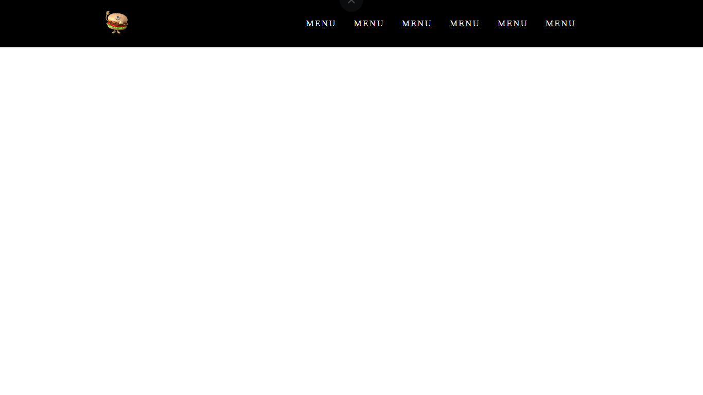

# Hamburger-Tutorial
This is a simple implementation of a hamburger menu, which is a common UI element used to display a navigation menu in a compact space.

## Features
- Responsive design: The hamburger menu adjusts to the size of the screen and displays the navigation links in a dropdown menu on smaller screens.
- Customizable: You can easily customize the appearance of the menu by changing the colors and fonts in the CSS file.
JavaScript functionality: The JavaScript file in this project controls the behavior of the hamburger menu, including toggling the dropdown menu when the menu button is clicked.
- <b>However, the CSS file is not supposed to be so long, it is just because this is a part of my previous project which had a lot of things and while doing this I had two combine two CSS files of two of my pages from the project and they have some repetetive and also some unused CSS styles.</b>

## Getting started
- Clone the repository: git clone https://github.com/arindam-sahoo/hamburger-tutorial.git
- Open the index.html file in a web browser to see the hamburger menu in action.

## Development
To make changes to the hamburger menu, you will need to edit the HTML, CSS files in the src directory.

- #### HTML
The HTML file contains the structure of the hamburger menu, including the navigation links and the menu button. You can add or remove links as needed.

- #### CSS
The CSS file controls the appearance of the hamburger menu, including the colors and fonts. You can customize the appearance of the menu by changing the values in the CSS file. <b>However, the CSS is not supposed to be so long, it is just because this is a part of my previous project which had a lot of things and while doing this I had two combine two CSS files of two of my pages from the project and they have some repetetive and also some unused CSS styles.</b>

- #### JavaScript
The JavaScript file contains the logic for controlling the behavior of the hamburger menu. This includes toggling the dropdown menu when the menu button is clicked and closing the menu when a navigation link is clicked.

## Screenshots

## Deployment
To deploy the hamburger menu to a live website, you will need to copy the files from the src directory to the root directory of your website. Make sure to include both the HTML, CSS, and JavaScript files, as well as any image files that are used in the menu.